# mgh
<h2>Método del Gradiente Hidráulico</h2>
Implementación en python3 de la metodología de análisis de redes propuesta por Pilati y Todini, 1987   

<h3>Objetivos</h3>
El objetivo de este sofware contar con una herramienta de docencia en los curso de hidráulica y mecánica de fluidos, y servir de base para modelos en tiempo real para toma desiciones a través de herramientas SCADA.    No pretende ser un software poderoso y potente como EPANet, sino una herramienta liviana para integrar en SCRIPTS de python para usar con modelos diagramáticos y simples.   Un objetivo adicional es podar contar con una herramienta para predecir desabastecimiento, a partir de datos en tiempo real.  

<h3>Descripción</h3>
En redacción   
El método se basa en que existe flujo permanente y se cumple la conservación de energía en los nudos. 
<table border="0"><tr><td>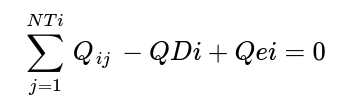</td><td>(1)</td></tr></table> 
Hay una relación no-lineal entre las pérdidas y el caudal en cada tramo, dado por: 
(2) 
En cada tramo toda la energía se consume en pérdidas: 
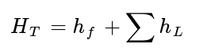(3) 
Si se consideran las pérdidas locales, bombas o elementos especiales la ecuación de energía de cada tramo se puede escribir como: 
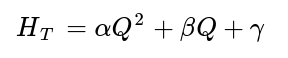(4) 
Por lo tanto &alpha; será: 
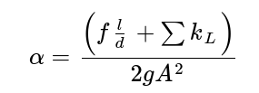(5)  
<h3>Definición de variables y matrices</h3> 
<ul>
<li>NT: número tuberías en la red (t)
<li>ND: número de nudos de demanda (carga desconocida) (n)
<li>NC: número de nudos de carga fija (carga conocida: tanques y embalses) (ns)
<li>[A12]: matriz de topología nudo a tramo para los nudos de demanda [t,n]
<li>[A10]: matriz topológina nudo-tramo de los nudos de carga fija [t,ns]
<li>[Q]: vector de caudales en los tramos [t,1]
<li>[H]: vector de cargas deconocidas en los nudos de demanda [n,1]
<li>[Ho]: vector de cargas conocidas en los nudos de carga fija [ns,1]
<li>[A11]: matriz con los valores &alpha;*Q+&beta;+&gamma;/Q en la diagonal [t,t]
<li>[q]: vector de demandas en los nudos [n,1]
<li>[A21]: matriz transpuesta de A12 requerida para operaciónes de multiplicación
<li>[N]: matriz de coeficientes de la ecuación de pérdidas, en este caso tiene el valor 2 en la diagonal
<li>[A11]': matriz con los valores &alpha;*Q en la diagonal (no inluye el efecto de &beta; y &gamma;)
<li>[dE]: vector que representa el desbalance de energía en cada tramo de la red [t,1]
<li>[dq]: vector que representa el desbalance de caudal en cada nudo de la red [n,1]
<li>[dQ]: vector cuyos valores son las diferencias de caudal en cada tramo entre una iteración y la siguiente
<li>[dH]: vector cuyos valores son las diferencias de carga en cada nudo entre una iteración y la siguiente
<li>[I]: matriz identidad (1 en la diagonal) de tamaño [t,t]
<li>[M1],[M2],[M3],[M4]: matrices intermedias del cálculo 
</ul>
La pérdida de carga en cada tramo de la red es: 
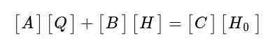(6) 
La anterior ecuación es la de conservación de energía.  
La ecuación de continuidad de caudal en los nodos está dada por: 
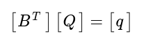 (7) 
Las ecuaciones (6) y (7) que se deben resolver en el método, se pueden escribir como: 
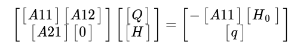(8) 
La anterior ecuación es no-lineal y debe sesolverse por medio de un algoritmo de iteración.  
En cada iteración se debe tratar de hacer converger [dE] y [dq] a cero, es decir que el desbalance de energía y de caudal en cada nodo debe converger a cero. [dE] y [dq] están dados por: 
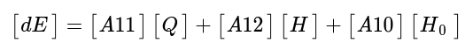(9) 
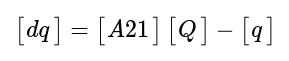(10) 
En los tramos y nudos, la variación del caudal en erl tramo y la carga en el nudo entre 2 iteraciones sucesivas está dado por: 
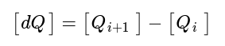(11) 
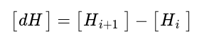(12) 
Posteriormente, la solución de cada iteración de la red se puede calcularse resolviendo el siguiente sistema de ecuaciones: 
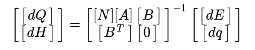(13) 
Para finalizar, recurriendo a algebra de matrices, la solución a la ecuación (13) está dada por el siguiente par de ecuaciones, en forma iterativa, siendo la iteración i+1 la sucesora de la iteración i: 
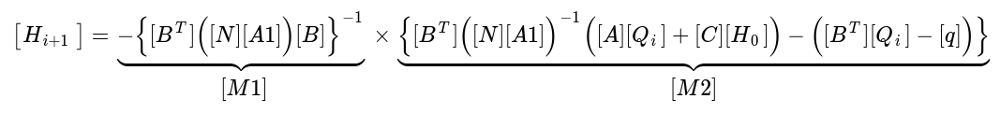(14) 
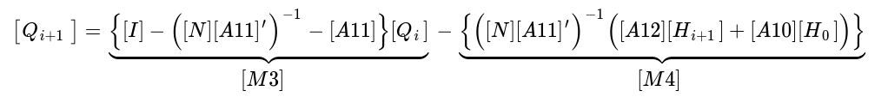(15) 
 

 
<h4>Características</h4>
<ol>
<li>Utiliza un archivo de entrada en formato CSV, pero se trabaja en el uso de un archivo JSON para hacer los datos más legibles
<li>Los resultados se obtienen por consola en un archivo tabulado, sin embargo se tiene pensado usar un archivo de salida en JSON
<li>Para el cálculo de las pérdidas por fricción se usa la ecuación de Darcy-Weisbach.  En el cálculo del factor de fricción f, se usa Swamee-Jain 
<li>Realiza la modelacición en forma puntual, un solo cálculo.  No se hace modelación en tiempo extendido.  No se modela el vaciado o llenado de tanques.
<li>El formato del archivo de entrada es tal cual sigue:
<pre>
Libro de Saldariaga                           TITULO
Ing. Carlos Camacho                           AUTOR
28/01/2019                                    FECHA
V0.01                                         VERSION
1.141E-6,1.0E-5,40                            VISCOSIDAD DINÁMICA, TOLERANCIA, ITERACIONES
1,5,7,1                                       NUDOS DE CARGA, NUDOS DE DEMANDA, TRAMOS, FACTOR DE DEMANDA GLOBAL
0,100,110,*                                   NUDO DE CARGA: NUMERO, ELEVACIÓN, CARGA, DEMANDA 
1,  90,  60,1                                 NUDO DE DEMANDA: NUMERO, ELEVACIÓN, DEMANDA, FACTOR
2,  90,  -40,1                                NUDO DE DEMANDA: NUMERO, ELEVACIÓN, DEMANDA, FACTOR 
3,  90,  30,1                                 NUDO DE DEMANDA: NUMERO, ELEVACIÓN, DEMANDA, FACTOR
4,  90,  30,1                                 NUDO DE DEMANDA: NUMERO, ELEVACIÓN, DEMANDA, FACTOR
5,  90,  40,1                                 NUDO DE DEMANDA: NUMERO, ELEVACIÓN, DEMANDA, FACTOR
0,  0,  1,  500,  250,  0.0015,  0,  TA, -    TRAMO: NUMERO, DESDE, HASTA, LONGITUD, DIAMETRO, Ks, KL, TIPO, OPCIONES
1,  1,  2,  400,  150,  0.0015,  10,  TA, -   TRAMO: NUMERO, DESDE, HASTA, LONGITUD, DIAMETRO, Ks, KL, TIPO, OPCIONES
2,  3,  2,  200,  100,  0.0015,  0,  TA, -    TRAMO: NUMERO, DESDE, HASTA, LONGITUD, DIAMETRO, Ks, KL, TIPO, OPCIONES
3,  4,  3,  400,  150,  0.0015,  0,  TA, -    TRAMO: NUMERO, DESDE, HASTA, LONGITUD, DIAMETRO, Ks, KL, TIPO, OPCIONES
4,  1,  4,  200,  100,  0.0015,  0,  TA, -    TRAMO: NUMERO, DESDE, HASTA, LONGITUD, DIAMETRO, Ks, KL, TIPO, OPCIONES
5,  5,  4,  600,  200,  0.0015,  0,  TA, -    TRAMO: NUMERO, DESDE, HASTA, LONGITUD, DIAMETRO, Ks, KL, TIPO, OPCIONES
6,  0,  5,  300,  250,  0.0015,  0,  TA, -    TRAMO: NUMERO, DESDE, HASTA, LONGITUD, DIAMETRO, Ks, KL, TIPO, OPCIONES
</pre>

<li>Tipos de nudo: <ul>
  <li> NC: Nudos de carga. Representan tanques o embalses. Actualmente son indiferentes porque no hay corridas de tiempo extendido.
     Los datos requeridos son: número de nudo, elevación [m], carga [m], tipo (T o E) el tipo no está implementado
  <li>ND: Nudos de demanda. Representan puntos de la red donde hay consumo y por lo tanto pre4sión dependiente de la demanda
     Los datos requeridos son: número de nudo, elevación [m], demanda [l/s], factor de demanda
  </ul>
<li>Tipos de tramo: <ul>
  <li>Tramo de tubería: Representan un tramo normal de tubo que puede estar cerrado o abierto.
     Los datos requeridos son: número de tramo, Desde y Hasta (topología de red), Longitud [m], Diámetro [mm], Ks [mm], KL, Estado TA= Tubería Abierta
     TC= Tubería Cerrada, Opciones (no tiene)
  <li>Válvula de control: Puede ser una válvula reductora de presión VR o una válvula sostenedora de presión VS.
     Los datos requeridos son: número de tramo, Desde y Hasta, Longitud de la cachera [m], Diámetro [mm], Ks [mm], KL, Tipo VS= Válvula Sostenedora
     VR= Válvula Reductora, Consigna [m] 
  <li>Bomba en un tramo de tubería: Los datos requeridos son: número de tramo, Desde y Hasta, Longitud de la cachera [m], Diámetro [mm], Ks [mm], KL,
     BO = Bomba, Coeficientes de la curva: alfa, beta, gama
  </ul>
<li>Tipos de corrida:<ul>
  <li>quiet o silencioso: muestra únicamente los valores de las tablas de cargas en los nodos y los caudales en los tramos de la última iteración 
  <li>normal: muestra las tablas de nudos y de tramos para la última iteración 
  <li>detallado (verbose): muestra las matrices del modelo, y las tablas de los datos de nudos y tramos de cada iteración
  </ul></ol>

<h4>Estado Actual</h4>

<h4>Por desarrollar</h4>
<ol>
  <li>Se debe desarrollar una interfaz de usuario para construir cada modelo, y hacer los archivos de entrada.
  <li>Se debe trabajar en el desarrollo de un tramo tipo "Válvula de retención o Check"
  <li>Emisores en los nudos de demanda
  <li>Ajuste de presiones negativas.  Es realmente importante qu el sistema se reponga del error de obtener presiones negativas cuando
    las consideraciones de demanda lo llevan más allá de las posibilidades físicas de caudal y carga.  Debe hacerse un algoritmo que iniciando con los 
    nudos negativos ajuste los caudales de demanda para que la presión en los nodos no tenga valores negativos en ninguna parte de la red.  Esto implica 
    que existirán lugares con demanda cero a causa del incremento de la demanda en otros nudos, empezando a afectar de arriba a abajo. 
    <li>Modelar en tiempo extendido, para considerar vaciado/llenado de tanques. Es necesario cambiar el archivo de entrada para incluir área de tanque y altura máxima
  </ol>
  
 
  
Carlos Camacho Soto, 2022
