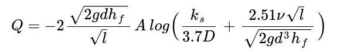
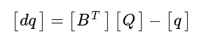
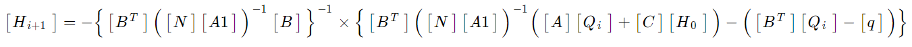
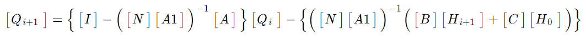

# mgh
<h2>Método del Gradiente Hidráulico</h2>
Implementación en python3 de la metodología de análisis de redes propuesta por Pilati y Todini, 1987 

Prof. Carlos Camacho Soto  

<h3>Licencia</h3>
GNU GENERAL PUBLIC LICENSE 
Versión 3, 29 Junio 2007   

<h3>Objetivos</h3>
<ul>
<li>Implementar una herramienta de docencia sobre diseño y análisis de redes hidráulicas, específicamente en los cursos de hidráulica y mecánica de fluidos
<li>Servir de base para modelos en tiempo real para toma decisiones a través de herramientas SCADA. 
<li>No pretende ser un software poderoso y potente como EPANet, sino una herramienta liviana para integrar en SCRIPTS de python para usar con modelos diagramáticos y simples.
<li>Poder montar SCRIPTs en un SCADA que permitan predecir el funcionamiento de un acueducto, modelado como una red diagramática a partir de datos en tiempo real: Predecir horarios de desabastecimiento, recuperación de los sistemas y resultado de posibles acciones operativas y maniobras de campo.
<li>Contar con una herramienta para solución rápida de ejercicios de los cursos de Mecánica de Fluidos e Hidráulica
</ul>
 

<h3>Sobre la implementación</h3>
Desarrollado y probado en:
<pre>
   Python 3.9.2 (default, Feb 28 2021, 17:03:44) 
   [GCC 10.2.1 20210110] on linux
</pre>
 
Requiere de: 
<pre>
   numpy >= 1.19.5
</pre>
  

<h3>Descripción</h3>
Inicialmente se asume que la red cumple con una topología de nudo-tramo de forma que toda la demanda se consume en los nudos.  En los tramos el caudal en constante a lo largo de su longitud. Los tanques y embalses tienen carga fija y conocida. Los nudos tienen demanda conocida pero carga desconocida.  El caudal en los tramos es desconocido. 
El método se basa en que existe flujo permanente y se cumple la conservación de energía en los nudos: 
<table border="0"><tr><td></td><td>(1)</td></tr></table> 
Hay una relación no-lineal entre las pérdidas y el caudal en cada tramo, dado por: 
<table border="0"><tr><td></td><td>(2)</td></tr></table> 
En cada tramo toda la energía se consume en pérdidas: 
<table border="0"><tr><td></td><td>(3)</td></tr></table> 
Si se consideran las pérdidas locales, bombas o elementos especiales la ecuación de energía de cada tramo se puede escribir como: 
<table border="0"><tr><td></td><td>(4)</td></tr></table> 
Por lo tanto &alpha; será: 
<table border="0"><tr><td></td><td>(5)</td></tr></table>  

<h3>Definición de variables y matrices</h3>
<ul>
<li>t: número tuberías en la red
<li>n: número de nudos de demanda (carga desconocida)
<li>ns: número de nudos de carga fija (carga conocida: tanques y embalses)
<li>[A]: matriz [t,t] con los valores &alpha;*Q+&beta;+&gamma;/Q en la diagonal, según ecuaciones 4 y 5  
<li>[A1]: matriz [A'] con los valores &alpha;*Q en la diagonal sin &beta; y &gamma;
<li>[B]: matriz [t,n ]de topología nudo a tramo para los nudos de demanda 
<li>[BT]: matriz transpuesta de [B] requerida para operaciónes de multiplicación
<li>[C]: matriz topológica nudo-tramo [t,ns] de los nudos de carga fija 
<li>[Q]: vector [t,1] de caudales en los tramos 
<li>[H]: vector [n,1] de cargas deconocidas en los nudos de demanda 
<li>[Ho]: vector [ns,1] de cargas conocidas en los nudos de carga fija 
<li>[q]: vector [n,1] de demandas en los nudos 
<li>[N]: matriz [t,t] de coeficientes de la ecuación de pérdidas, en este caso tiene el valor 2 en la diagonal
<li>[dE]: vector [t,1] que representa el desbalance de energía en cada tramo de la red 
<li>[dq]: vector [n,1] que representa el desbalance de caudal en cada nudo de la red 
<li>[dQ]: vector cuyos valores son las diferencias de caudal en cada tramo entre una iteración y la siguiente
<li>[dH]: vector cuyos valores son las diferencias de carga en cada nudo entre una iteración y la siguiente
<li>[I]: matriz identidad (1 en la diagonal) de tamaño [t,t]
<li>[M1], [M2], [M3], [M4] y [M5]: matrices intermedias del cálculo 
<li>[Hi]: Cargas en los nudos de la iteración actual
<li>[Qi]: Caudales en los tramos de la iteración actual
</ul>
La pérdida de carga en cada tramo de la red es: 
<table border="0"><tr><td></td><td>(6)</td></tr></table> 
La anterior ecuación es la de conservación de energía.  
La ecuación de continuidad de caudal en los nodos está dada por: 
<table border="0"><tr><td> </td><td>(7)</td></tr></table> 
Las ecuaciones (6) y (7) que se deben resolver en el método, se pueden escribir como: 
<table border="0"><tr><td></td><td>(8)</td></tr></table>
La anterior ecuación es no-lineal y debe resolverse por medio de un algoritmo de iteración.  
En cada iteración se debe tratar de hacer converger [dE] y [dq] a cero, es decir que el desbalance de energía y de caudal en cada nodo debe converger a cero. [dE] y [dq] están dados por: 
<table border="0"><tr><td></td><td>(9)</td></tr>
<tr><td></td><td>(10)</td></tr></table> 
En los tramos y nudos, la variación del caudal en el tramo y la carga en el nudo entre 2 iteraciones sucesivas está dado por: 
<table border="0"><tr><td></td><td>(11)</td></tr>
<tr><td></td><td>(12)</td></tr></table> 
Posteriormente, la solución de cada iteración de la red se puede calcularse resolviendo el siguiente sistema de ecuaciones: 
<table border="0"><tr><td></td><td>(13)</td></tr></table> 
Para finalizar, recurriendo a algebra de matrices, la solución a la ecuación (13) está dada por el siguiente par de ecuaciones, en forma iterativa, siendo la iteración i+1 la sucesora de la iteración i: 
<table border="0"><tr><td></td><td>(14)</td></tr>
<tr><td></td><td>(15)</td></tr></table> 
 

 
<h3>Características</h3>
<ol>
<li>Utiliza un archivo de entrada en formato CSV, pero se trabaja en el uso de un archivo JSON para hacer los datos más legibles
<li>Los resultados se obtienen por consola en un archivo tabulado, sin embargo se tiene pensado usar un archivo de salida en JSON
<li>Para el cálculo de las pérdidas por fricción se usa la ecuación de Darcy-Weisbach.  En el cálculo del factor de fricción f, se usa Swamee-Jain 
<li>Realiza la modelación en forma puntual, un solo cálculo.  No se hace modelación en tiempo extendido.  No se modela el vaciado o llenado de tanques.
<li>El formato del archivo de entrada es el que sigue:
<table border="0"><tr><td>
<pre>
 1
 2
 3
 4
 5
 6
 7
 8
 9
10
11
12
13
14
15
16
17
18
19
</pre></td>
 <td>
<pre>
Red de ejemplo 1                              
Ing. Carlos Camacho                           
28/01/2019                                    
V0.01                                         
1.007E-6, 1.0E-5, 40                            
1, 5, 7, 1                                       
0, 100, 110, *                                    
1,  90,  60, 1                                 
2,  90,  20, 1                               
3,  90,  30, 1                                 
4,  90,  30, 1                                 
5,  90,  40, 1                                 
0,  0,  1,  500,  250,  0.0015,  2,  TA, -    
1,  1,  2,  500,  150,  0.0015,  1,  TA, -   
2,  3,  2,  200,  100,  0.0015,  2,  TA, -    
3,  4,  3,  400,  150,  0.0015,  3,  TA, -    
4,  1,  4,  200,  100,  0.0015,  8,  TA, -    
5,  5,  4,  700,  200,  0.0015,  0,  TA, -    
6,  0,  5,  300,  250,  0.0015,  0,  TA, -    
</pre>
</td></tr></table>
<h4>Descripción del formato</h4>
La descripción de cada línea se hará con base en su número:
<ol type="1">
<li>TÍTULO: del archivo o nombre de la red o proyecto
<li>AUTOR: autor del modelo
<li>FECHA: de la modelación
<li>VERSIÓN: la versión del modelo, puede usar números o indicar notas: máxima demanda, mínimo nocturno, etc
<li>VISCOSIDAD, DESBALANCE, ITERACIONES: Viscosidad a usar en cálculos de pérdidas, Desbalance de caudales y Número de iteraciones permitidas para usar como parámetro de parada de las iteraciones
<li>NC, ND, NT, FVH: Número de nodos de carga fija, Número de nodos de demanda, Número de tramos y Factor de variación horaria global
<li>NUDO DE CARGA FIJA: en este caso solo este renglón: Número de nudo, Elevación topográfica [m], Carga hidráulica [m], asterisco (null)
<li>NUDO DE DEMANDA: número de nudo, Elevación topográfica [m], Demanda [l/s], Factor de demanda del nudo
<li>NUDO DE DEMANDA: número de nudo, Elevación topográfica [m], Demanda [l/s], Factor de demanda del nudo
<li>NUDO DE DEMANDA: número de nudo, Elevación topográfica [m], Demanda [l/s], Factor de demanda del nudo
<li>NUDO DE DEMANDA: número de nudo, Elevación topográfica [m], Demanda [l/s], Factor de demanda del nudo
<li>NUDO DE DEMANDA: número de nudo, Elevación topográfica [m], Demanda [l/s], Factor de demanda del nudo
<li>TRAMO DE TUBERÍA: Número de tramo, Desde nudo, Hasta nudo, Longitud [m], Diámetro [mm], Ks [mm], KL, Tipo de tramo, Opciones 
<li>TRAMO DE TUBERÍA: Número de tramo, Desde nudo, Hasta nudo, Longitud [m], Diámetro [mm], Ks [mm], KL, Tipo de tramo, Opciones
<li>TRAMO DE TUBERÍA: Número de tramo, Desde nudo, Hasta nudo, Longitud [m], Diámetro [mm], Ks [mm], KL, Tipo de tramo, Opciones
<li>TRAMO DE TUBERÍA: Número de tramo, Desde nudo, Hasta nudo, Longitud [m], Diámetro [mm], Ks [mm], KL, Tipo de tramo, Opciones
<li>TRAMO DE TUBERÍA: Número de tramo, Desde nudo, Hasta nudo, Longitud [m], Diámetro [mm], Ks [mm], KL, Tipo de tramo, Opciones
<li>TRAMO DE TUBERÍA: Número de tramo, Desde nudo, Hasta nudo, Longitud [m], Diámetro [mm], Ks [mm], KL, Tipo de tramo, Opciones
<li>TRAMO DE TUBERÍA: Número de tramo, Desde nudo, Hasta nudo, Longitud [m], Diámetro [mm], Ks [mm], KL, Tipo de tramo, Opciones
</ol>

<li>Tipos de nudo: <ul>
  <li> NC: Nudos de carga. Representan tanques o embalses. Actualmente son indiferentes porque no hay corridas de tiempo extendido.
     Los datos requeridos son: número de nudo, elevación [m], carga [m], tipo (T o E) el tipo no está implementado
  <li>ND: Nudos de demanda. Representan puntos de la red donde hay consumo y por lo tanto pre4sión dependiente de la demanda
     Los datos requeridos son: número de nudo, elevación [m], demanda [l/s], factor de demanda
  </ul>
<li>Tipos de tramo: <ul>
  <li>Tramo de tubería: Representan un tramo normal de tubo que puede estar cerrado o abierto.
     Los datos requeridos son: número de tramo, Desde y Hasta (topología de red), Longitud [m], Diámetro [mm], Ks [mm], KL, Estado TA= Tubería Abierta
     TC= Tubería Cerrada, Opciones (no tiene)
  <li>Válvula de control: Puede ser una válvula reductora de presión VR o una válvula sostenedora de presión VS.
     Los datos requeridos son: número de tramo, Desde y Hasta, Longitud de la cachera [m], Diámetro [mm], Ks [mm], KL, Tipo VS= Válvula Sostenedora
     VR= Válvula Reductora, Consigna [m] 
  <li>Bomba en un tramo de tubería: Los datos requeridos son: número de tramo, Desde y Hasta, Longitud de la cachera [m], Diámetro [mm], Ks [mm], KL,
     BO = Bomba, Coeficientes de la curva: alfa, beta, gama
  </ul>
<li>Tipos de corrida:<ul>
  <li>quiet o silencioso: muestra únicamente los valores de las tablas de cargas en los nodos y los caudales en los tramos de la última iteración 
  <li>normal: muestra las tablas de nudos y de tramos para la última iteración 
  <li>detallado (verbose): muestra las matrices del modelo, y las tablas de los datos de nudos y tramos de cada iteración
  </ul></ol>

<h3>Estado Actual</h3>
El programa está siendo codificado en Python3 a partir de una implementación inicial hecha en PHP, ubicada en https://hid.segundafundacion.com/mgh/mgh.html  
Actualmente no se han hecho pruebas de su funcionamiento.  Estamos en etapa de pruebas. 

<h3>Por desarrollar</h3>
<ol>
  <li>Una interfaz de usuario para construir cada modelo y hacer los archivos de entrada de forma amigable.
  <li>Implementar un tramo tipo "Válvula de retención o check"
  <li>Implementar emisores en los nudos de demanda
  <li>Ajuste de presiones negativas.  Es realmente importante qu el sistema se reponga del error de obtener presiones negativas cuando las consideraciones de demanda lo llevan más allá de las posibilidades físicas de caudal y carga.  Debe hacerse un algoritmo que iniciando con los nudos negativos ajuste los caudales de demanda para que la presión en los nodos no tenga valores negativos en ninguna parte de la red.  Esto implica que existirán lugares con demanda cero a causa del incremento de la demanda en otros nudos, empezando a afectar de arriba a abajo. 
    <li>Modelar en tiempo extendido, para considerar vaciado/llenado de tanques. Es necesario cambiar el archivo de entrada para incluir área de tanque y altura máxima
  <li>Mostrar licencia y versión por medio de una opción, ejm: mgh -lv
  <li>Entrada y salida de datos por medio de archivos JSON
  <li>Falta revisar si el archivo de entrada existe y si se puede abrir...
  </ol>
  
<h3>Contenido</h3>
<table><tr><th>Archivo</th><th>Descripción</th></tr>
<tr><td>mgh.py</td><td>Archivo ejecutable en python con el método del gradiente hidráulico.</td></tr>
<tr><td>f_hid.py</td><td>Funciones hidráulicas requeridas en el cálculo de pérdidas de carga y caudales</td></tr>
<tr><td>f_io.py </td><td>Funciones de entrada y salida de datos</td></tr>
<tr><td>COPYING</td><td>Permiso de copia y distribución de mgh</td></tr>
<tr><td>LICENSE</td><td>Texto de la licencia GPL 3</td></tr>
<tr><td>README.md</td><td>Este documento</td></tr>
<tr><td>img</td><td>Carpeta que contiene las imágenes de este README y otras</td></tr>
<tr><td>input</td><td>Carpeta para los archivos de entrada de los modelos de redes a correr:</td></tr>
<tr><td>&nbsp;&nbsp;&#9493; default.mgh</td><td>Archivo de entrada de pruebas con una red simple</td></tr>
<tr><td>&nbsp;&nbsp;&#9493; default-error-topol.mgh</td><td>Archivo de entrada para probar error topológico de una red</td></tr>
<tr><td>&nbsp;&nbsp;&#9493; default.mgh.json</td><td>Archivo de entrada en formato JSON a usar en futuras versiones</td></tr>
<tr><td>&nbsp;&nbsp;&#9493; EjemploBomba.mgh</td><td>Red simple con una bomba</td></tr>
<tr><td>&nbsp;&nbsp;&#9493; EjemploVRP.mgh</td><td>Red simple con una Válvula reductora de presión</td></tr>
<tr><td>&nbsp;&nbsp;&#9493; P3Tanques.mgh </td><td>Solución al problema de los tres tanques</td></tr>
<tr><td>&nbsp;&nbsp;&#9493; CaudalMax.mgh</td><td>Determinación del caudal máximo en una tubería</td></tr>
<tr><td>output</td><td>Carpeta a usar para el envío de los archivos de salida:</td></tr>
<tr><td>&nbsp;&nbsp;&#9493; default.mgh.out</td><td>Archivo de salida de pruebas con una red simple</td></tr>
<tr><td>&nbsp;&nbsp;&#9493; EjemploBomba.mgh.out</td><td>Salida de red simple con una bomba</td></tr>
<tr><td>&nbsp;&nbsp;&#9493; EjemploVRP.mgh.out</td><td>Salida de red simple con una Válvula reductora de presión</td></tr>
<tr><td>&nbsp;&nbsp;&#9493; P3Tanques.mgh.out</td><td>Salida de solución al problema de los tres tanques</td></tr>
<tr><td>&nbsp;&nbsp;&#9493; CaudalMax.mgh.out</td><td>Salida de determinación del caudal máximo en una tubería</td></tr>
</table>

 <h3>Modo de uso</h3>
 <pre>
 Modo de uso:  python mgh.py nombre_archivo.mgh opcion
 -----------------------------------------------------

Opciones:
-n: modo normal, por defecto, imprime tablas de datos de entrada y salida

-q: modo silencioso, solo imprime los vectores H y Q, de alturas piezométricas
    en los nudos y caudales en los tramos

-v: modo elocuente, imprime tablas de datos de entrada y salida, todos los vec
    tores y matrices; y los resultados de cada iteración

Observaciones:
La salida del programa va dirigida a la consola: "stdout"
Para redirigir la salida use entubamiento con > o con >>

Ejemplo: 
  python mgh.py ./input/default.mgh -v > ./output/default.mgh.out 
</pre>

Carlos Camacho Soto, 2022
