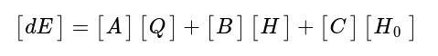
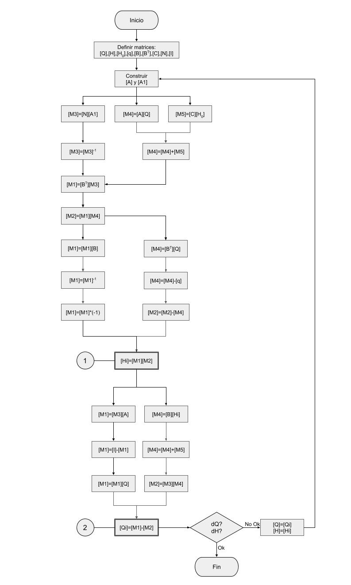

# mgh
## Método del Gradiente Hidráulico
Implementación en python3 de la metodología de análisis de redes propuesta por Pilati y Todini, 1987 

Prof. Carlos Camacho Soto  

### Licencia y Copyright
Publicado bajo la licencia GPL-3: GNU General Public License - versión 3 del 29 Junio de 2007  
Copyright © 2022 Carlos Camacho Soto  
 
This file "README.md" is part of mgh  
mgh is free software: you can redistribute it and/or modify it under the terms of the GNU General Public License as published by the 
Free Software Foundation, either version 3 of the License, or (at your option) any later version.  
mgh is distributed in the hope that it will be useful, but WITHOUT ANY WARRANTY; without even the implied warranty of MERCHANTABILITY 
or FITNESS FOR A PARTICULAR PURPOSE. 
See the GNU General Public License for more details. 
You should have received a copy of the GNU General Public License along with mgh.  
 

### Objetivos

- Implementar una herramienta de docencia sobre diseño y análisis de redes hidráulicas, específicamente en los cursos de hidráulica y mecánica de fluidos
- Servir de base para modelos en tiempo real para toma decisiones a través de herramientas SCADA. 
- No pretende ser un software completo y potente como EPANet, sino una herramienta liviana para implementar SCRIPTS de python para usar con modelos diagramáticos y simples.
- Poder montar SCRIPTS en un SCADA que permitan predecir el funcionamiento de un acueducto, modelado como una red diagramática a partir de datos en tiempo real: Predecir horarios de desabastecimiento, recuperación de los sistemas y resultado de posibles acciones operativas y maniobras de campo.
- Contar con una herramienta para solución rápida de ejercicios de los cursos de Mecánica de Fluidos e Hidráulica
- Eventualmente se buscará ajustar los caudales del modelo cuando ocurran presiones negativas en algunos nodos, tratando de estimar los posibles caudales realistas
  
 

<h3>Sobre la implementación</h3>
Desarrollado y probado en:
<pre>
   Python 3.9.2 (default, Feb 28 2021, 17:03:44) 
   [GCC 10.2.1 20210110] on linux
</pre>
 
Requiere de: 
<pre>
   numpy >= 1.19.5
</pre>
  

### Descripción

Inicialmente se asume que la red cumple con una topología de nudo-tramo de forma que toda la demanda se consume en los nudos.  En los tramos el caudal en constante a lo largo de su longitud. Los tanques y embalses tienen carga fija y conocida. Los nudos tienen demanda conocida pero carga desconocida.  El caudal en los tramos es desconocido. 
El método se basa en que existe flujo permanente y se cumple la conservación de energía en los nudos: 
<table border="0"><tr><td></td><td>(1)</td></tr></table> 
Hay una relación no-lineal entre las pérdidas y el caudal en cada tramo, dado por: 
<table border="0"><tr><td></td><td>(2)</td></tr></table> 
En cada tramo toda la energía se consume en pérdidas: 
<table border="0"><tr><td></td><td>(3)</td></tr></table> 
Si se consideran las pérdidas locales, bombas o elementos especiales la ecuación de energía de cada tramo se puede escribir como: 
<table border="0"><tr><td></td><td>(4)</td></tr></table> 
Por lo tanto &alpha; será: 
<table border="0"><tr><td></td><td>(5)</td></tr></table>  

### Definición de variables y matrices

- t: número tuberías en la red
- n: número de nudos de demanda (carga desconocida)
- ns: número de nudos de carga fija (carga conocida: tanques y embalses)
- [A]: matriz [t,t] con los valores &alpha;*Q+&beta;+&gamma;/Q en la diagonal, según ecuaciones 4 y 5  
- [A1]: matriz [A'] con los valores &alpha;*Q en la diagonal sin &beta; ni &gamma;
- [B]: matriz [t,n] de topología nudo a tramo para los nudos de demanda 
- [BT]: matriz transpuesta de [B] requerida para operaciones de multiplicación
- [C]: matriz topológica nudo-tramo [t,ns] de los nudos de carga fija 
- [Q]: vector [t,1] de caudales en los tramos (contendrá los datos de la iteración anterior)
- [H]: vector [n,1] de cargas deconocidas en los nudos de demanda (contendrá los datos de la iteración anterior)
- [Ho]: vector [ns,1] de cargas conocidas en los nudos de carga fija 
- [q]: vector [n,1] de demandas en los nudos 
- [N]: matriz [t,t] de coeficientes de la ecuación de pérdidas, en este caso tiene el valor 2 en la diagonal
- [dE]: vector [t,1] que representa el desbalance de energía en cada tramo de la red 
- [dq]: vector [n,1] que representa el desbalance de caudal en cada nudo de la red 
- [dQ]: vector cuyos valores son las diferencias de caudal en cada tramo entre una iteración y la anterior
- [dH]: vector cuyos valores son las diferencias de carga en cada nudo entre una iteración y la anterior
- [I]: matriz identidad (1 en la diagonal) de tamaño [t,t]
- [M1], [M2], [M3], [M4] y [M5]: matrices intermedias del cálculo 
- [Hi]: Cargas en los nudos de la iteración actual
- [Qi]: Caudales en los tramos de la iteración actual
  
 
La pérdida de carga en cada tramo de la red, correspondiente a la ecuación de conservación de la energía, es: 
<table border="0"><tr><td></td><td>(6)</td></tr></table>
La ecuación de continuidad de caudal en los nodos está dada por: 
<table border="0"><tr><td> </td><td>(7)</td></tr></table>
Las ecuaciones (6) y (7) que se deben resolver en el método, pueden escribirse como: 
<table border="0"><tr><td></td><td>(8)</td></tr></table>
La anterior ecuación es no-lineal y debe resolverse por medio de un algoritmo de iteración.  
En cada iteración se debe tratar de hacer converger [dE] y [dq] a cero, es decir que el desbalance de energía y de caudal en cada nodo debe converger a cero. [dE] y [dq] están dados por: 
<table border="0"><tr><td></td><td>(9)</td></tr>
<tr><td></td><td>(10)</td></tr></table>
En los tramos y nudos, la variación del caudal en el tramo y la carga en el nudo entre 2 iteraciones sucesivas está dado por: 
<table border="0"><tr><td></td><td>(11)</td></tr>
<tr><td></td><td>(12)</td></tr></table>
Posteriormente, la solución de cada iteración de la red se puede calcularse resolviendo el siguiente sistema de ecuaciones: 
<table border="0"><tr><td></td><td>(13)</td></tr></table>
Para finalizar, recurriendo a algebra de matrices, la solución a la ecuación (13) está dada por el siguiente par de ecuaciones, las cuales deben resolverse de forma iterativa. De modo que las matrices [Hi+1] y [Qi+1] cuando coverjan tendrán los valores de Caudales en los tramos y Alturas piezométricas en los nodos 
<table border="0"><tr><td></td><td>(14)</td></tr>
<tr><td></td><td>(15)</td></tr></table>
 
El método iterativo para resolver las ecuaciones (14) y (15) se ilustra en la figura siguiente:  
   
- Primero, con los datos del archivo de entrada se construyen las matrices topológicas: [B], [BT] y [C]
- Se asumen valores arbitrarios para la matriz [Q] caudales en los tramos: 0.1 l/s, por ejemplo
- Con esos valores de [Q] y las características de los tubos y elevaciones de los nudos se determina una matriz inicial [A] y [A1] con los valores de &alpha; que corresponden al valor de resistencia de la tubería al flujo.
- Luego se itera en el calculo de [Hi] y [Qi], correspondientes a la iteración i. Para esto se requiere el uso de matrices temporales [M1], [M2], [M3], [M4] y [M5]
- En cada iteración se compara [Hi] con [H] y [Qi] con [Q] para verificar convergencia: [dQ] y [dH]. Además hay un contador de iteraciones máximas.
- El algoritmo se detiene cuando los valores de [dQ] sean menores a una tolerancia de cálculo dada, en caso contrario, incrementa el contador, copia los valores de [Hi] en [H] y los de [Qi] en [Q] y vuelve a iterar, primero recalculando las matrices [A] y [A1] y resolviendo de nuevo [Hi] y [Qi] 

#### Diagrama de flujo del cálculo de Hi y Qi
 
    

### Características
  
- Utiliza un archivo de entrada en formato JSON, para hacer los datos más legibles por humanos.
-  Los resultados se obtienen por consola o por medio de archivo.  EL formato de salida puede ser escogido entre formato de tablas de texto TXT, por medio de formato de valores separados por comas CSV o por medio de formato de JSON
- Para el cálculo de las pérdidas por fricción se usa la ecuación de Darcy-Weisbach.  En el cálculo del factor de fricción f, se puede escoger entre usar Swamee-Jain o la ecuación de Colebrook-White 
- Realiza la modelación en forma puntual, un solo cálculo.  Se trabaja en la modelación en tiempo extendido y el modelado de vaciado o llenado de tanques
- Los elementos tipo nudo se dividen en 2 tipos:
    - Nudos de carga fija, en el que se modelan tanques, embalses y emisores
    - NUdos de demanda en los que además de demandas en los nudos se pueden modelar fuentes de abastecimiento tipo manantial
- Los elementos tipo línea o tramo permiten modelar varios tipos de accesorios, y con eluso de una variable de estado pueden estar abiertos/cerrados en caso de tubos y válvulas y encendidos/apagados en caso de bombas.  Los elementos modelados son:
    - Todos los elementos tipo línea funcionan como válvula de corte, es decir se pueden abrir o cerrar completamente
    - Tubería simple TS
    - Tubería con válvula reductora de presión VR
    - Tubería con válvula sostenedora de presión VS
    - Tubería con bomba BO
    - Tubería del tipo emisor (debe ser conectada a un nudo tipo emisor)
    - Tubería con válvula reguladora de caudal VQ
    - Tubería con válvula CHECK que se cierra si el caudal es negativo (contrario a la dirección asignada) CK.  Nota: Los tramos tipo bomba también funcionan como Check
- El formato del archivo de entrada es el que sigue:
        
      {
      	"titulo": "Ejemplo de libro",
      	"autor": "Carlos Camacho Soto",
      	"fecha": "28/01/2019",
      	"version": "v0.0.1",
      	"descripcion": "Anotar datos sobre el modelo, corrida, objetivo, etc",
      	"viscosidad": 1.007E-6,
      	"imbalance": 1E-5,
      	"max_iteraciones": 40,
      	"ecuacion": "S",
      	"duracion": 24,
      	"tolerancia": 1.0E-5,
      	"factor_demanda_global": 1.0,
      	"nudos_carga": [{
      		"id": 0,
      		"elevacion": 100,
      		"carga": 110,
      		"base": 900,
      		"hmax": 5.45
      	}],
      	"nudos_demanda": [{
      			"id": 1,
      			"elevacion": 90,
      			"demanda": 60,
      			"factor": 1.0
      		},
      		{
      			"id": 2,
      			"elevacion": 90,
      			"demanda": -40,
      			"factor": 1.0
      		},
      		{
      			"id": 3,
      			"elevacion": 90,
      			"demanda": 30,
      			"factor": 1.0
      		},
      		{
      			"id": 4,
      			"elevacion": 90,
      			"demanda": 30,
                  "factor": 1.0
      		},
      		{
      			"id": 5,
      			"elevacion": 90,
      			"demanda": 40,
      			"factor": 1.0
      		}
      	],
      	"tramos": [{
      			"id": 0,
      			"desde": 0,
      			"hasta": 1,
      			"longitud": 500,
      			"diametro": 250,
      			"ks": 0.0015,
      			"kL": 0,
      			"tipo": "TS",
      			"opciones": "-",
      			"estado": 1
      		},
      		{
      			"id": 1,
      			"desde": 1,
      			"hasta": 2,
      			"longitud": 400,
      			"diametro": 150,
      			"ks": 0.0015,
      			"kL": 10,
      			"tipo": "TS",
      			"opciones": "-",
      			"estado": 1
      		},
      		{
      			"id": 2,
      			"desde": 3,
      			"hasta": 2,
      			"longitud": 200,
      			"diametro": 100,
      			"ks": 0.0015,
      			"kL": 0,
      			"tipo": "TS",
      			"opciones": "-",
      			"estado": 1
      		},
      		{
      			"id": 3,
      			"desde": 4,
      			"hasta": 3,
      			"longitud": 400,
      			"diametro": 150,
      			"ks": 0.0015,
      			"kL": 0,
      			"tipo": "TS",
      			"opciones": "-",
      			"estado": 1
      		},
      		{
      			"id": 4,
      			"desde": 1,
      			"hasta": 4,
      			"longitud": 200,
      			"diametro": 100,
      			"ks": 0.0015,
      			"kL": 0,
      			"tipo": "TS",
      			"opciones": "-",
      			"estado": 1
      		},
      		{
      			"id": 5,
      			"desde": 5,
      			"hasta": 4,
      			"longitud": 600,
      			"diametro": 200,
      			"ks": 0.0015,
      			"kL": 0,
      			"tipo": "TS",
      			"opciones": "-",
      			"estado": 1
      		},
      		{
      			"id": 6,
      			"desde": 0,
      			"hasta": 5,
      			"longitud": 300,
      			"diametro": 250,
      			"ks": 0.0015,
      			"kL": 0,
      			"tipo": "TS",
      			"opciones": "-",
      			"estado": 1
      		}
      	]
      }
 
El anterior archivo de entrada corresponde al ejemplo mostrado en la siguiente figura:
 
Se incluye en el contenido de la carpeta principal, un archivo con la solución del ejercicio anterior por medio de una hoja eletrónica, llamado "GradienteHidráulico.xlsx", el cual fue usado como comprobación del funcionamiento de mgh. 

#### Descripción del formato del archivo de entrada
El archivo está en formato JSON, por lo que su contenido es autoexplicativo, contiene las siguientes variables de entrada:
    
     - Título del archivo o nombre de la red o proyecto
     - Autor del modelo
     - Fecha de referencia de la modelación
     - Versión del modelo: puede usar números o texto: máxima demanda, mínimo nocturno, etc
     - Viscosidad cinemática en [m2/s] a usar en cálculos de pérdidas
     - Desbalance de caudales como presición de las iteraciones
     - Número de iteraciones permitidas para usar como parámetro de parada
     - Ecuación a usar para f: S=Swamee-Jain  C=Colebrook-White
     - Factor de variación horaria global
     - Nudos de carga fija: Lista de nudos con: id, Elevación topográfica [m], Carga hidráulica [m], hmax [m], Volumen[m3]
     - Nudos de demanda: Lista de nudos con: id, Elevación topográfica [m], Demanda [l/s], Factor de demanda del nudo, Ecuacion_emisor
     - Tramos: Lista de objetos tipo línea, con: id, Desde nudo, Hasta nudo, Longitud [m], Diámetro [mm], Ks [mm], KL, Tipo de tramo, Opciones, Estado 
     - Los tipos de tramo pueden ser: TS=tubo simple, BO=Bomba, VS=Válvula sostenedora, VR=Válvula reductora, CK=Válvula de retención
     - Curvas de demanda: una lista de los patrones de demanda a usar en la ejecución de tiempo extendido

- Tipos de nudo: 
  - NC: Nudos de carga fija. Representan tanques o embalses. La diferencia radica en que por su gran área, los embalses tienen una variación de nivel nula en el tiempo extendido. Los datos requeridos son: número de nudo, elevación [m], carga [m], tipo (Tanque o Emisor). En el tipo Tanque hay que agregar las características: volumen,aŕea, altura
  - ND: Nudos de demanda. Representan puntos de la red donde hay consumo y por lo tanto presión dependiente de la demanda. Los datos requeridos son: número de nudo, elevación [m], demanda [l/s], factor de demanda, curva de demanda.  Este tipo de nudo se usa para representar fuentes de producción como toma, manantial, asignando una demanda negativa [l/S]
 
- Tipos de tramo: 
  - Tramo de tubería: Representan un tramo normal de tubo que puede estar cerrado o abierto. Los datos requeridos son: número de tramo, Desde y Hasta (topología de red), Longitud [m], Diámetro [mm], Ks [mm], KL, Tipo TS= Tubería Simple , Opciones (no tiene), estado =1/0 
  - Válvula de control: Puede ser una válvula reductora de presión VR, una válvula sostenedora de presión VS o una válvula reguladora de caudal VQ. Los datos requeridos son: número de tramo, Desde y Hasta, Longitud de la cachera [m], Diámetro [mm], Ks [mm], KL, Tipo VS/ VR= Válvula Reductora VQ, Consigna [m] 
  - Bomba en un tramo de tubería: Los datos requeridos son: número de tramo, Desde y Hasta, Longitud de la cachera [m], Diámetro [mm], Ks [mm], KL, BO = Bomba, Coeficientes de la curva: alfa, beta, gama
  - Tramos con válvula Check.  Requiere los mismos datos de una tubería normal.  La diferencia es que el tramo check se cierras o desconecta si el flujo va en la dirección contraria a la estipulada con los valores Desde y Hasta.
 
- Tipos de corrida:
  - quiet o silencioso: muestra únicamente los valores de las tablas de cargas en los nodos y los caudales en los tramos de la última iteración 
  - normal: muestra las tablas de nudos y de tramos para la última iteración 
  - detallado (verbose): muestra las matrices del modelo, y las tablas de los datos de nudos y tramos de cada iteración
  - interactivo: pregunta los datos de la red, del modelo, los nudos y los tramos y ejecuta una corrida y salva el archivo de entrada
 
- Formatos de salida:
  - Formato de tablas en texto plano: .TXT
  - Formato en valores separados por comas: .CSV
  - Formato de archivo JavaScript Object Notation: .JSON
 
- Direccionamiento de la salida:
  - salida estandard a ternminal: STDOUT
  - salida a archivo, cuya extensión será de acuerdo al formato de salida elegido.  Por defecto la salida de archivos va dirigida a ./output/
  - También es posible dirigir la salida a un archivo por medio de pipes
 

### Estado Actual y en desarrollo
El programa está siendo codificado en Python3 a partir de una implementación inicial hecha en PHP, ubicada en https://hid.segundafundacion.com/mgh/mgh.html  
Actualmente se trabaja en la codificación de ciertas rutinas. Estamos en etapa de implementación y pruebas. 
  
- Lectura de archivo de entrada tipo JSON (antes usaba CSV) &#10003;
- Funciones hidráulicas: Áreas, velocidades, Reynolds, Pérdidas hf y hL  &#10003;
- Cálculo de f por el método de Swamee-Jain &#10003;
- Cálculo de f por el método de Colebrook-White &#10003;  
- Construcción de matrices topológicas: A, B, C &#10003;
- Contrucción de matrices ALPHA: A y A1 &#10003;
- Construcción de otras matrices y vectores: N, I &#10003;
- Algoritmo de cálculo de Hi y Qi por iteración &#10003;
- Inclusión de accesorios especiales: 
   - Válvula Sostenedora `VS`, Válvula Reductora `VR`, Bomba `BO` &#10003; 
   - Tubería Cerrada `estado=0`, Válvula de retención o Check `CK` &#10003;
   - Válvula limitadora de caudal `VQ` &#10007;
   - Tramo tipo emisor  Emisor `EM` &#10007;
   - Nudos tipo Embalse o Reservorio `RE`, Tanque `TQ` &#128269;
   - Nudos de demanda con capacidad de "aportar" caudal para modelar nacientes o pozos: Fuente `FU` &#10003;
- Cálculo de caudal de entrada o salida en nodos de carga fija &#10003;
- Cambio del campo `Estado` por `tipo` y agregar el espacio `estado` que contemple 1=ON 0=OFF para usarse en tuberías, válvulas y bombas &#10007;
- Selección de ecuación a usar (S-J ó C-W): &#10003;
- Impresión de resultados en tablas &#10003;
- Impresión de matrices en modo detallado &#10003;
- Impresión de salida quiet: solo tablas de caudales y cargas &#10003;
- Salida de datos por medio de JSON, CSV y TXT &#10003;
- Entrada de datos por medio de JSON &#10003;
- Programa rudimentario para crear redes en JSON &#10003; 
- Aplicación para construir redes usando NCURSES &#10007;
- Documentación &#128269;
- Usar diccionarios para nudos tramos y datos generales &#10003;
- Crear un archivo de configuración para tipo ecuación, cantidad de iteraciones, tolerancias, etc &#10007;
- Leer datos de demandas de un archivo independiente o vectores &#10007;
- Construcción de la red desde terminal (muy rudimentariamente) y correr la red &#10003;
- Agregar variable para el nombre descriptivo de cada elemento, ya sea tipo nudo o tramo {"nombre": "T-01-M01: Curridabat"} &#10007;
- Leer por defecto de input y guardar por defecto en output, permitiendo además escoger una ruta &#128269;
- Opción para correr en modo interactivo `-i`  que permita construir el modelo, salvarlo en `fin.mgh` y correrlo &#128269;
- Programa para convertir archivos de entrada CSV en .JSON &#10003;

### Por desarrollar en el futuro

- Una interfaz de usuario para construir cada modelo y hacer los archivos de entrada de forma amigable.
- Implementar un tramo tipo "Válvula de retención o check"
- Implementar emisores en los nudos de demanda
- Ajuste de presiones negativas.  Es realmente importante qu el sistema se reponga del error de obtener presiones negativas cuando las consideraciones de demanda lo llevan más allá de las posibilidades físicas de caudal y carga.  Debe hacerse un algoritmo que iniciando con los nudos negativos ajuste los caudales de demanda para que la presión en los nodos no tenga valores negativos en ninguna parte de la red.  Esto implica que existirán lugares con demanda cero a causa del incremento de la demanda en otros nudos, empezando a afectar de arriba a abajo. 
-Modelar en tiempo extendido, para considerar vaciado/llenado de tanques. Es necesario cambiar el archivo de entrada para incluir área de tanque y altura máxima
- Mostrar licencia y versión por medio de una opción, ejm:  `mgh -lv`
- Entrada y salida de datos por medio de archivos JSON
- Hacer un SCRIPT que tome datos aleatorios a partir la distribución de probabilidades de FVH para cada nudo, los asigne a los nudos de demanda, que ejecute mgh y devuelva vectores de Q, H, P, qi.  Que realice esto una gran cantidad de veces y luego obtenga el comportamiento medio de la red. Aplicación de Montecarlo a la red. **Opcionalmente**: Obtener el caudal probabílistico de cada nudo usando Montecarlo y luego hacer solamente una simulación de la red usando los caudales probables en cada nudo. 
- opción para salida a archivo por defecto con:  `-f`  sale a  `fin.out`
- opción para especificar archivo de salida `-o fout`
- incluir en el archivo de entrada `fin` referecia(s) a curva de demanda, puede ser en el mismo archivo o en archivo externo
- correr el modelo en tiempo extendido, para lo que se requiere incluir el tiempo: 24, 48, 72 horas. Puede ser útil especificar hora de inicio y hora de fin
- crear un archivo de configuración, posiblemente `config.json` donde se definan variables:
  - imbalance
  - tiempo extendido ???
  - MaxIt: número máximo de iteraciones
  - Ecuación a usar (Colebrook-White/Swamee-Jain)
  - Tolerancia del cálculo de f en Colebrook-White
- En ejecución de tiempo extendido permitir niveles de tanque sobre rebalse y bajo piso para estimar tiempo y volumen de recuperación o pérdida
- Crear y usar patrones de demanda y oferta para los nudos:
  - Factor de variación horaria: `FVH`
  - Factor de variación según día de la semana: `FVdow`
  - Factor de variación según mes del año: `FVm`
  - Factor de variación de la producción: `FVP` : `['normal': 1.0, 'lavado':0.75, 'sobrecarga': 1.25]`
- Modelar tramos a canal abierto.  Requiere un algoritmo para determinar si una tubería entra o sale de régimen de flujo a canal abierto 

 

### Contenido de la carpeta

| Archivo                               |   Descripción                                                                      |
|---------------------------------------|------------------------------------------------------------------------------------|
| `mgh.py`                              |Programa en python con el método del gradiente hidráulico : **MGH**.                |
| `f_hid.py`                            |Funciones hidráulicas requeridas en el cálculo de pérdidas de carga y caudales      |
| `f_io.py`                             |Funciones de entrada y salida de datos: impresión de matrices, vectores y resultados|
| `json_io.py`                          |Programa para crear redes en formato .json y convertir CSV en json: rudimentario    |
| `tirante.py`                          |Programa para determinar si una tubería está a canal abierto o a presión            |
| `LICENSE`                             |Texto de la licencia GPL-3                                                          |  
| `README.md`                           |Este documento                                                                      |
| `docs`                                |Carpeta con documentos relativos al proyecto mgh                                    |
|&nbsp;&#9493; `DeterminarCanalAbierto.ods` |Hoja elecctrónica para análisis de alcantarillas                                |
|&nbsp;&#9493; `GradienteHidráulico.xlsx`  |Método del gradiente desarrollado en una hoja electrónica - ejercicio de comparación|
|&nbsp;&#9493; `Temas pendientes....docx`  |Documento con discusión sobre temas pendientes e eideas                         |
|&nbsp;&#9493; `Valores-Kv-Hidrantes.ods`  |Hoja electrónica para calcular la Kv de emisores                                |
| `img`                                 |Carpeta que contiene las imágenes de este README y otras                            |
| `input`                               |Carpeta para los archivos de entrada de los modelos de redes a correr:              |
|&nbsp;&#9493; `default.mgh`            |Archivo de entrada de pruebas con una red simple                                    |
|&nbsp;&#9493; `default-error-topol.mgh`|Archivo de entrada para probar error topológico de una red                          |
|&nbsp;&#9493; `default.mgh.json`       |Archivo de entrada en formato JSON a usar en futuras versiones                      |
|&nbsp;&#9493; `EjemploBomba.mgh`       |Red simple con una bomba                                                            |
|&nbsp;&#9493; `EjemploVRP.mgh`         |Red simple con una Válvula reductora de presión                                     |
|&nbsp;&#9493; `P3Tanques.mgh`          |Solución al problema de los tres tanques                                            |
|&nbsp;&#9493; `CaudalMax.mgh`          |Determinación del caudal máximo en una tubería                                      |
|&nbsp;&#9493; `Red-mixta.mgh`          |Red mixta (abierta y cerrada) para pruebas                                          |
|&nbsp;&#9493; `EjemploVSP.mgh`         |Red simple con váñlvula sostenedora de presión                                      |
|&nbsp;&#9493; `Qmax-VRP.mgh`           |Caudal máximo en tubería simple con Válvula Reductora                               |
|&nbsp;&#9493; `Qmax-VSP.mgh`           |Caudal máximo en tubería simple con Válvula Sostenedora                             |
|&nbsp;&#9493; `Naciente.mgh`           |Utilización de los nodos de demanda como fuente tipo manantial o naciente Q=cte     |
| `output`                              |Carpeta a usar para el envío de los archivos de salida:                             |
|&nbsp;&#9493; `default.mgh.out`        |Archivo de salida de pruebas con una red simple                                     |
|&nbsp;&#9493; `EjemploBomba.mgh.out`   |Salida de red simple con una bomba                                                  |
|&nbsp;&#9493; `EjemploVRP.mgh.out`     |Salida de red simple con una Válvula reductora de presión                           |
|&nbsp;&#9493; `P3Tanques.mgh.out`      |Salida de solución al problema de los tres tanques                                  |
|&nbsp;&#9493; `CaudalMax.mgh.out`      |Salida de determinación del caudal máximo en una tubería                            |

 

### Modo de uso

                        METODO DEL GRADIENTE HIDRÁULICO              crcs 2022             
    -------------------------------------------------------------------------- 
    
    Modo de uso:  python mgh.py nombre_archivo opcion
                                                                              
    Opciones:                                               
    -n: modo normal, imprime tablas de datos de entrada y salida (DEFAULT)
    -q: modo silencioso, solo imprime los vectores H y Q finales
    -v: modo detallado, imprime tablas de datos de entrada y salida, los vec-
        tores y matrices y los resultados de cada iteración en TXT 
    -j: formato de salida JSON
    -c: formato de salida CSV
    -t: formato de salida tabular en TXT (DEFAULT)
    -s: direccionamiento de salida a terminal o stdout (DEFAULT)
    -f: direcionamiento de salida a archivo por defecto
    -i: modo interactivo, permite construir y correr la red                                         
    
    Ejemplos:
      python3 mgh.py ./input/default -njf          
      python3 mgh.py default.mgh -vf
      python3 mgh.py default -nts  
      python3 mgh.py ./input/default.mgh.json -qc
      python3 mgh.py -i
    
    

----------

Carlos Camacho Soto, 2022
